МИНИСТЕРСТВО НАУКИ  И ВЫСШЕГО ОБРАЗОВАНИЯ РОССИЙСКОЙ ФЕДЕРАЦИИ  

Федеральное государственное автономное образовательное учреждение высшего образования  

"КРЫМСКИЙ ФЕДЕРАЛЬНЫЙ УНИВЕРСИТЕТ им. В. И. ВЕРНАДСКОГО"  

ФИЗИКО-ТЕХНИЧЕСКИЙ ИНСТИТУТ  

Кафедра компьютерной инженерии и моделирования
<br/><br/>
### Отчёт по лабораторной работе № 1<br/> по дисциплине "Программирование"
<br/>
​Cтудента 1 курса группы ПИ-б-о-192(1)<br/>
Гусько Елизавета Викторовна<br/>
направления подготовки 09.03.04 "Программная инженерия"  
<br/>


<br/>
<table>

<tr><td>Научный руководитель<br/> старший преподаватель кафедры<br/> компьютерной инженерии и моделирования</td>

<td>(оценка)</td>

<td>Чабанов В.В.</td>

</tr>

</table>

<br/><br/>

​

Симферополь, 2019

<br/>

# Лабораторная работа №1

# Изучение базовых возможностей MS Visual Studio

### ***Цель***: изучить основные возможности создания и отладки программ в IDE MS Visual Studio.

#### 1.Как создать консольное приложение С++.<br/>
1. Запускаем приложение MS Visual Studio.  
2. Выбираем пункт "Создание проекта" <br/>
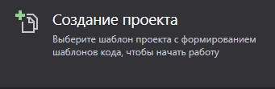
>рис.1 создание проекта

3. Выбираем пункт "Консольное приложение"<br/>
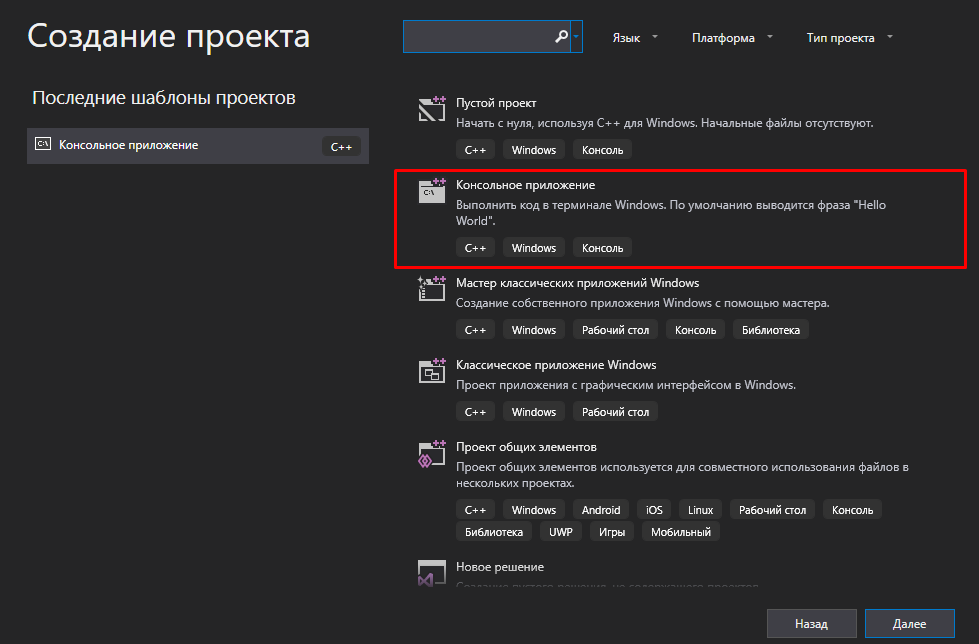
>рис.2 консольное приложение

#### 2.Как изменить цветовую схему (оформление) среды.<br/>
1. В строке **меню** выбираем пункт **Средства** -> **параметры**  <br/>
 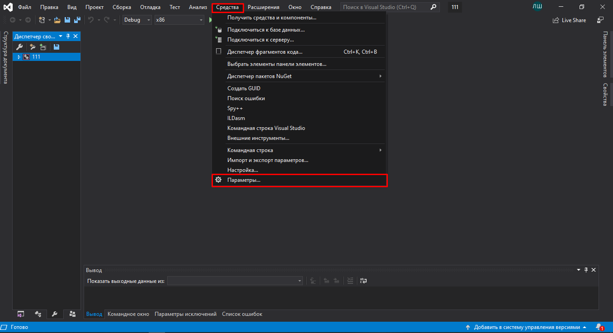
 > рис.3 параметры
 2. Выбираем пункт **Окружение** -> **Общие** -> *Цветовая тема*<br/>
 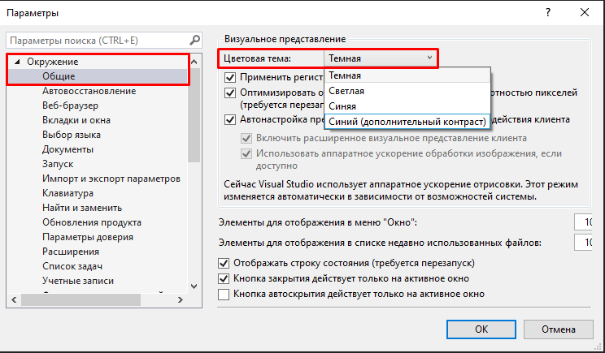
 > рис.4 изменение цветовой темы

 #### 3.Как закомментировать/раскомментировать блок кода средствами VS. <br/>
1.  Ctrl+K, Ctrl+C(комбинация) — закомментирование строки<br/>
2. Ctrl+K, Ctrl+U(комбинация) — раскомментирование строки<br/>
 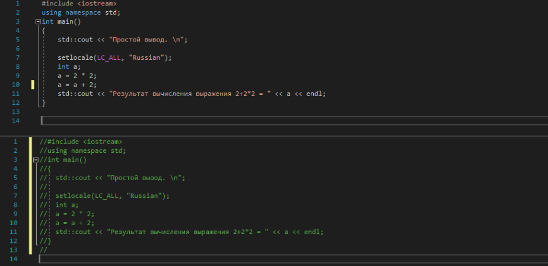
 > рис.5 закомментирование/раскомменнтирование части кода
 #### 4. Как открыть в проводнике Windows папку с проектом средствами VS.<br/>
 1. При создании проекта выбираем пункт **открыть локальную папку**<br/>
 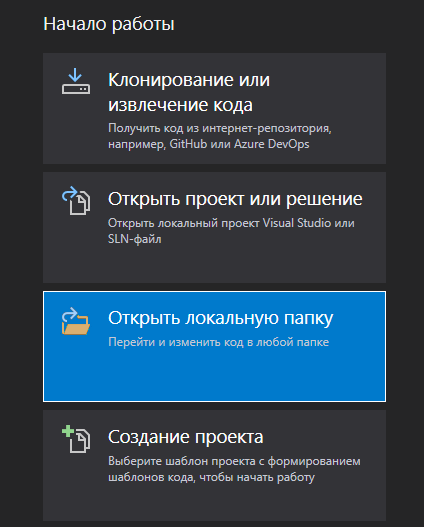
 > рис.6 локальная папка

 2. Выбираем папку, в которой хотим изменить код<br/>

 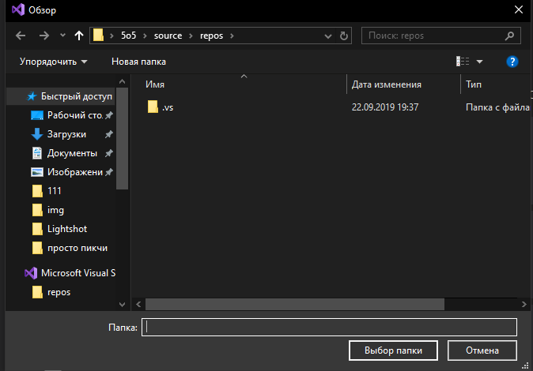
 > рис.7 выбор папки
 #### 5. Какое расширение файла-проекта используется в VS.
 Файл-проект использует расширение **Solution file(.sln)**<br/>
 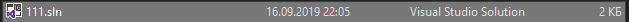
 > рис.8 Solution file(.sln)
 #### 6. Как запустить код без отладки.
 1. Запуск кода без отладки в ручную<br/>
<small>Выбираем в меню пункт **отладка**</small><br/>
<small>Запускаем код *без отладки*</small><br/>

 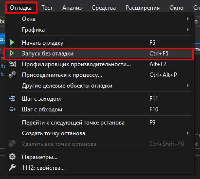
 > рис.9 запуск без отладки
 2. Запуск кода без отладки через горячие клавиши<br/>
 <small>Комбинация клавиш *ctrl+f5*</small><br/>

 #### 7. Как запустить код в режиме отладки
 1. Запуск кода в режиме отладки в ручную<br/>
 <small>Выбираем в меню пункт **отладка**</small><br/>
 <small>Запускаем пункт *начать отладку*</small><br/>

 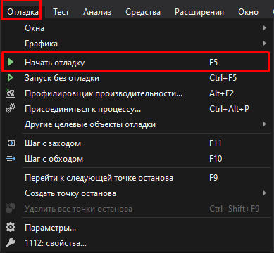
 > рис.10 запуск с отладкой
2. Запуск кода в режиме отладки через горячие клавиши<br/>
 <small>клавиша *f5*</small><br/>

 #### 8. Как установить/убрать точку останова (breakpoint).
 1. Для того чтобы установить точку останова в данном коде, щелкаем *лкм* в левом поле рядом со строкой кода<br/>
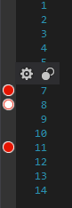
 > рис.11 установка точки останова
 2. Для того чтобы убрать точку останова, щелкаем по установленной кнопке останова пкм и выбираем пункт **удалить точку останова**<br/>
 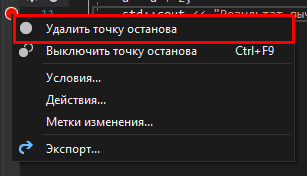
 > рис.12 удаление точки останова

 #### 9. Создайте программу со следующим кодом:
```
#include <iostream>
​
int main() 
{
    int i;
    i = 5;
    std::cout << i;
    return 0;
}
```
* Переключитесь в конфигурацию сборки Debug;<br/>
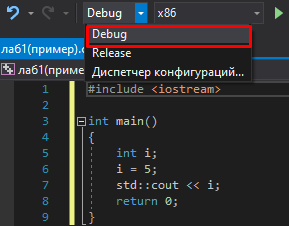
 > рис.13 переключение в конфигурацию сборки Debug
 * Установите breakpoint на 5 и 6 строках;<br/>
 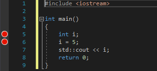
 > рис.14 установили breakpoint на 5 и 6 строках
 * Запустите приложение в режиме отладки. Используйте Кнопку Продолжить или Шаг с обходом для перемещения к следующей точке останова;
* Какое значение содержит переменная i в 5й строке?<br/>
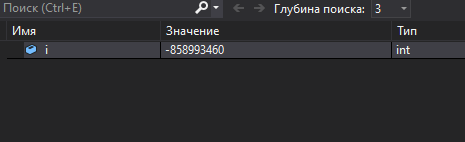
 > рис.15 значение переменной i в 5й строке
* Какое значение содержит переменная i в 6й строке?<br/>
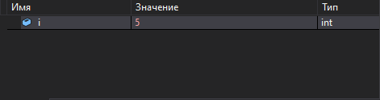
 > рис.16 значение переменной i в 6й строке

 #### 10. Выполните задание 9 изменив программу на следующую:
 ```
 #include <iostream>

int main() 
{
    double i;
    i = 5;
    std::cout << i;
    return 0;
}
```
* Переключитесь в конфигурацию сборки Debug;<br/>
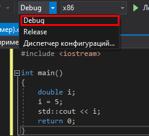
 > рис.17 переключение в конфигурацию сборки Debug
 * Установите breakpoint на 5 и 6 строках;<br/>
 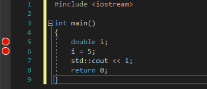
 > рис.18 установили breakpoint на 5 и 6 строках
  * Запустите приложение в режиме отладки. Используйте Кнопку Продолжить или Шаг с обходом для перемещения к следующей точке останова;
* Какое значение содержит переменная i в 5й строке?<br/>
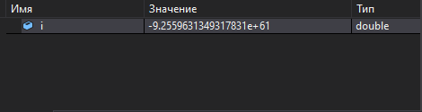
 > рис.19 значение переменной i в 5й строке
* Какое значение содержит переменная i в 6й строке?<br/>
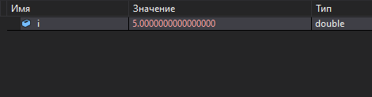
 > рис.20 значение переменной i в 6й строке

 ### ***Вывод***:  Я закрепила знания об основных возможностях создания и отладки программ в IDE MS Visual Studio.
